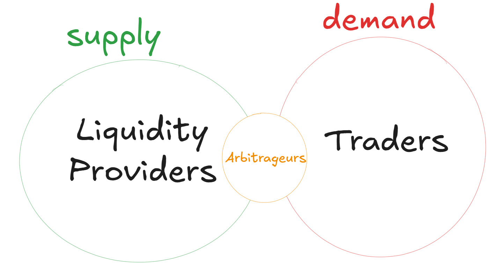

# KAPPA: Adaptive AMM Curvature through Oracle-Driven Market Calibration

  

## Overview

Kappa is a CFMM-type AMM based on CPMM pools (specifically Uniswap V2 and Sushiswap). It replicates existing pools and assigns the optimal curvature to the underlying trading function, based on market conditions, empirically.

## Problem

### Traditional Finance Market Making Rewiew

In traditional market making liquidity providers revenue is the reward for the price discovery work they do, this is, they fix prices that aim to be equilibrium prices (price that reflects the fundamental value of the underlying asset traded in the market they provide liquidity), and all this process is ex-ante, the most common mechanism to fix prices is through LOB (limit order books) and the frequency they update prices depends on market conditions.

Since liquidity providers are facilitatiing liquidity to traders, the reward for this is to set a spread, meaning traders pay different prices depending on the operation they perform (buy or sell). Then the revenue of market makers is simply this spread. At a high level we can express this mathematically as:

$$

\Pi^{LP} = Y^{LP}(\mid P^{ASK/BID}-P\mid)- C^{LP}

$$
Where $\Pi^{LP}$ is the profit function $Y^{LP}$ is the revenue (which is the spread). This can be seen in the traditional firm theory perspective where the income per unit is the sale price times the quantity sold by setting the quantity sold as the amount the trader is demanding liquidity for and the sale price is the bid and ask price which is the sale price of liquidity.

But, what about the costs they face:
- What form does the cost take?
- How is it originated?
- What parameters define it endogoneusly?

All this questions can take different routes depending on the undeerlying market microstructure, but since our ultimate goal is to provide the foundations of the economic problems CFMM economic agents face, we will use as refernce the Gleston \& ... model, for quoting prices where liquidity providers are ex-ante price fixers, then.

- **What form does the cost take?**
  
  **R/**
  
   The cost they face is an adverse selection cost, this is. there exists a risk that the price they fix to be the equilibrium price is outdated due to a information shock that moved the equilibrium price to a given direction. 

- **How is it originated?**

   **R/** 
   
   Information shocks (innovation shocks in classic firm theory)  introduces a new economic agent that will enter the market to update the price prior to the liquidity provider by trading the underlying asset in the external market in whatever direction will put the liquidity provider market price back to equilibrium, but by doing so it has extracted value that would otherwise belong to the liquidity provider.

- **What parameters define it endogoneusly?**

   **R/** 

   Naturally one can think that the greater the shock, the greater the value that an arbitrageur can extract from the liquidity provider. And this is actually correct, a good estimator of wild movementts in prices from a tationary point is volatility.
   
   Therefore at a high level we have the arbitrageur payoff function as:
   $$

   \Pi^{ARB} = Y^{ARB}(\sigma^2)- C^{ARB}(\mid P^{ASK/BID}-P\mid)

   $$

Therefore another work that has to be done by liqiuidity providers is ensure that their pricing system is resilient to volatility.

One common hedge they have for this adverse selection cost is the establishment of trading fees. 

This adds a constraint to the arbitrageur profit maximization problem as increases slippage costs and if the slippage costs are sufficiently high they wont trade as their prfit will be negative, as trading fees $\phi$ will increase their cost. Summarizing we have the three payoff function of all of our economic agents.
$$

\begin{cases}

\Pi^{LP} = Y^{LP}(\mid P^{ASK/BID}-P\mid, \phi)- C^{LP}(\sigma^2)
\\
\Pi^{ARB} = Y^{ARB}(\sigma^2)- C^{ARB}(\mid P^{ASK/BID}-P\mid, \phi)\\
\Pi^{TRADER} = Y^{TRADER}(U(X)) - C^{TRADER}(\mid P^{ASK/BID}-P\mid, \phi)\\
\end{cases}
$$

**Summary**

- Liquidty providers provide liquidty ex-ante are price makers and compete with arbitrageurs for rents
  
- Arbitrageurs are renters, which are market inefficiency as they extract value from the market

- Traders maximize their utility
- Traders and arbitrageurs are botgh in the demand side as they share the same cost function even though their goals are different

### AMM As Economic Systems

AMM's aim to provide a feasible way to implement a liquidity makret given the fact that blockchains introduce non-trivial network fees for all transactions.

The design of CFMM has been the most succesful and widely accepted mechanism. CFMM's define a multifaceted trading function that defines the rules for supply and demand.

From this fucntion bid and ask prices are defined. This is arguably the most destable feature as it inttroduces a whole new approach for marktet making, Under this approach, it follows.

- Liquidity provider are price takers
- The equilibrium price is completly left to be adjusted by the demand, this is liquidity providers do not perform the price discovery process, instead they ceed this to arbitrageours who now correct prices from internal non-informed traders shocks **back-running** and external price shocks **front-running**
These powerful consequences entirely modify the payoff structure of the agents, We have:

$$

\begin{cases}

\Pi^{LP} = Y^{LP}(\phi)- C^{LP}(\sigma^2, \mid P^{ASK/BID}-P\mid)
\\
\Pi^{ARB} = Y^{ARB}(\sigma^2, \mid P^{ASK/BID}-P\mid^{BACK \, RUNNING})- C^{ARB}(\mid P^{ASK/BID}-P\mid^{FRONT \, RUNNING}, \phi)\\
\Pi^{TRADER} = Y^{TRADER}(U(X)) - C^{TRADER}(\mid P^{ASK/BID}-P\mid, \phi)\\
\end{cases}
$$

A few thincs can be said about the above relations:

- The arbitarge is now rewarded from slippage and is also part of their cost functions
- Liquidty providera re only compensated with fees as they hold inventory risk, however they have ceeded price discovery to arbitrageurs and therefore slippage is no longer a reward for them but to arbitrageurs.
- Compared to traditional market making **arbitrageurs** are no longer a makeket inefficeincy bu a vital part of the CFMM at leats at its current stage.

**Questions arise:**

- How to incentivize liquidity providers to take inventory risk?
- What is the most optimla mechanisms for price discovery ?
   - If arbitrageurs how incentivize them ?
- How to attract trading volume ?

  

### Current Protocol Desings Issues

CPMM were the first CFMM implemented by Uniswap, however its tradign function it's bid and ask prices are passively adjusted by liquidyt providers flow. the more liquidity they enter the lower the trading function curvature and thus the lower the slippage cost, and the less liquidity they leave the higher the trading function curvature and thus higher the slippage cost.

In other words the protocol indirectly assumes that liquidity providers always optimize their inventories, which is no longer the case (technicall efficiency for liquidity providers).

As we have implied here there is an inverse relation between the slippage cost nd the cruvature, the relation is

$$

\kappa_F = \frac{\partial C_{SLIPPAGE}}{\partial \Delta X}

$$

Where $\Delta X$ is the amount of the risky traded. This means that having control of the trading function curvature enables the power of price making, since an optimal trading function curvature would the optimal bid and ask prices.

- How do we find this optimal trading function curvature? 
- What exogeneties does this introduce ?
- What is the optimla way to address them ?

## Solution

### Adaptive Trading Function

To make the curvature a explicit, we procced with the paramterization:

$$F_{\kappa_F}(R_x,R_y) = (1-\kappa_F)(R_x+R_y)+\kappa_F(R_xR_y)$$

where $\kappa_F \in [0,1]$

## Method

1. The user selects a pair of traded tokens already in a CPMM market.
2. An oracle from the most liquid pool is assigned to the pool.
3. The pool conditions are replicated in proportion to the initial 4. 
4. liquidity provided by the user.
5. The curvature is obtained parametrically from the oracle pool.
6. The oracle signals the pool when events occur.
7. The pool automatically adjusts its curvature based on the oracle's input.

## Derivation

We want to find a parametric expression for $\kappa_F$, nased on the result:

$$

\begin{aligned}

\kappa_F^* & = \kappa_F \equiv \max_{(\sum_{t=1}^T \Delta X_t, \sum_{t=1}^T \Delta Y_t)} \frac{(P_{Y/X})_T\cdot \sum_{t=1}^T \Delta X_t + \sum_{t=1}^T \Delta Y_t }{((P_{Y/X})_T\cdot R_X + R_Y)} \\

s.t \\

& \, \forall_t \Delta X_t \leq (R_X)_t \, \wedge \, \Delta Y_t \leq (R_Y)_t \\
& \, \sum_{t=1}^T \Delta X_t \leq (R_X)_T \\
& \, \sum_{t=1}^T \Delta Y_t \leq (R_Y)_T\\   

\end{aligned}

$$

This is find where the trading volume is maximum at certain time.

If we define the optimal curvature parametically as a function of the volume parameters.

And given a parametric or numerical value for the curvature at that point in that time would give us an inefficiency estimator.

$$\forall_t \, d(\kappa_F, \kappa_F^*)_t$$
