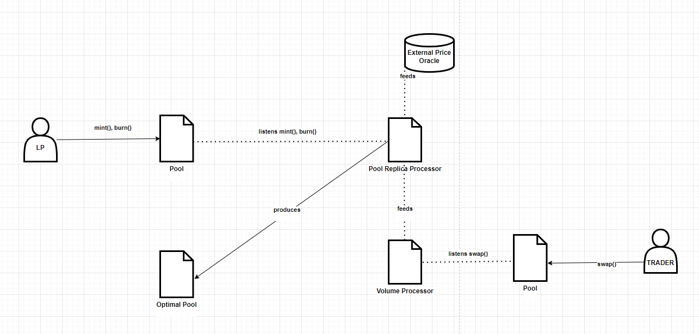

# Kappa: About System Contracts Design &  Specification

## Overview

Kappa is a CFMM-type AMM based on CPMM pools (Specifically Uniswap V2).

It replicates existing pools and assigns the optimal curvature to the underlying trading function, based on market conditions, empirically.

## Index
- High-Level System Design
- High-Level System Arquitecture
- High-Level Contracts Design
- Contracts Addresses
- Chain Explorers
- Further References

## High-Level System Design
The protocol **functionality** can be summarized as follows:

- **Actively** reacts to **each** liquidity provider action by warning him/her whether the operation is sub-optimal or not.
- **Passively** listens to swap actions and processes them for liquidity demand estimation and signals
- **Pro-actively** alters liquidity providers inventory based on demand estimation signals.

  

## High-Level System Arquitecture
- Kappa pool replica is deployed on the same chain from the reference UniswapV2 pool
- Reactive network is used as the API 

  

## High-Level Contracts Design

## Contract Addresses
## Chain Explorers
## Further References

